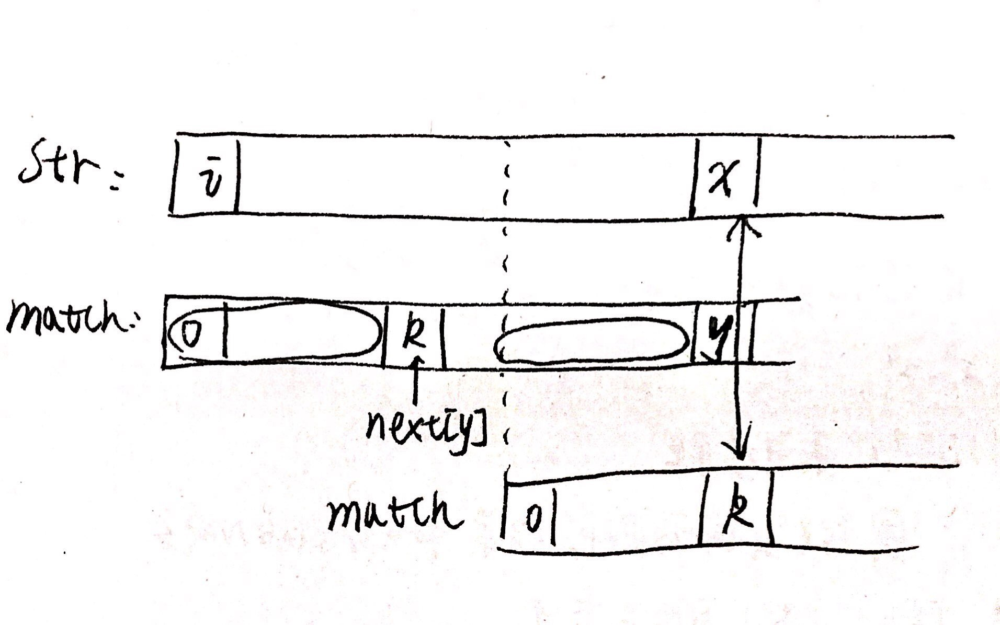
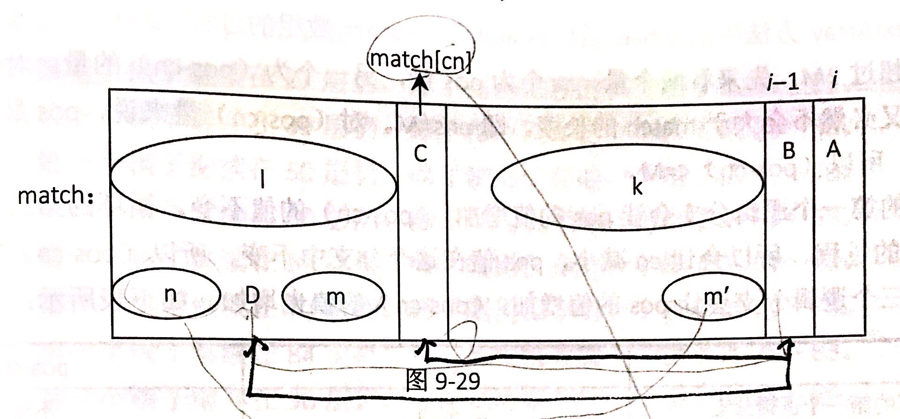

# KMP算法
[完整代码](https://github.com/ludandandan/Programmer-interview-guide/blob/master/Chapter01_AdvancedVideo/strStrKMP.cpp)

**题目：**

给定两个字符串str和match，长度分别为N和M。实现一个算法，如果字符串str中含有子串match，则返回match在str中的位置，不含有就返回-1。

**举例：**

str="acbc"，match="bc"，返回2

str="acbc"， match="bcc"， 返回-1

**要求：**

要求时间复杂度O(N)

**解析：**

实际上这个题目是实现string的find方法。

当然可以使用暴力方法，从分别以str[0], str[1]...str[N-M-1]开头开始尝试看能不能把match匹配出来，这样的时间复杂度是O(N*M)，可以用做对数器，但是不能满足题目要求。

这是因为这种暴力方法没有利用之前匹配失败的信息，而KMP算法正是让之前匹配过的信息来加速后面的。

KMP算法是一种解决包含问题的方法。它只能解决包含子数组，子串（连续的），而不能解决子序列的包含问题。

KMP算法首先对match字符串进行遍历，得到一个next数组。这个数组长度与match字符串长度相等。next[i]表示的是match[i]之前的字符串（即match[0,...,i-1]）的最长前缀和最长后缀的匹配长度。要求前缀不能包含最后一个字符（即match[i-1]）后缀不能包含第一个字符（即match[0]）。人为定义next[0]=-1, next[1]=0, **注意：** 若match的长度不足2，就可能不需要填。 例如字符串"abcabcd"的next数组为[-1,0,0,0,1,2,3]。next数组的求法稍后介绍。

假设我们已经有了match字符串的next数组信息。若match与str开始匹配，从str[i]匹配match[0]开始，一路都可以匹配上，直到遇到str[x]与match[y]无法匹配。
1.  若是对于普通的暴力方法，此时会从str[i+1]开始匹配match[0]
2.  而KMP算法会从next数组中取出此时match[y]的最长前缀和最长后缀的匹配长度next[y]，让str[x]与match[next[y]]开始匹配。实际上是让str[x-next[y]]开始与match[0]开始匹配，可是由于前面一定是匹配的，所有从str[x]与match[next[y]]开始匹配（match[next[y]]前面有next[y]个字符）。所以对于str，匹配的指针一直往右走而不回退，所以时间复杂度为O(N)。

若是str[x]与match[k]还不匹配，那么match再往前跳，检查str[x]与match[next[k]]是否匹配。直到匹配上了，或者next[k]等于-1了，说明到头了，str[x]连match[0]都匹配不上，只能往前走看str[x+1]了。

在编写code时，

     若此时为str[i1]与match[i2]匹配。
    1. 若str[i1]==match[i2]，那么就是匹配上了，i1++， i2++
    2. 若str[i1]!=match[i2]，
       1. 若i2=-1了，那么就是str[i1]连match的开头match[0]都匹配不上，那么只能i1++，在看看能不能匹配上match[0]的开头
       2. 若i2!=1，说明还可以往前跳，那么让i2=next[i2],再让str[i1]与match[i2]尝试匹配。

**next数组的求解：**
    
next[i]表示match[i]之前的字符串的最长前缀和最长后缀的匹配长度。

并且人为规定next[0]=-1,next[1]=0

那么已知next[i-1]求next[i]的方法是，

1. 先检查match[next[i-1]]与match[i-1]是否匹配，若是匹配，那么next[i]=next[i-1]+1
2. 若是不匹配，那么就跳到match[next[next[i-1]]]的位置再匹配，若是能匹配，那么next[i]=next[next[i-1]]+1，若是还不能匹配，就再往前跳，直到跳到0位置了，不能往前跳了，那么让next[i]=0

code编写：

    若已知next[i-1]求next[i]:
    1. 定义一个整型变量cn表示当前跳到的位置，先让cn=next[i-1]，
       1. 若是match[cn]==match[i-1]那么就让next[i]=(++cn);同时i++; 
            **注意cn和i都有变化**
       1. 若是match[cn]!=match[i-1]
          1. 若是cn>0，说明前面还有数（有cn个数），还可以往前跳，这时让cn=next[cn],再检查match[cn]是否等于match[i-1];
          2. 若是cn==0了，说明前面没有数了，跳无可跳了，那么就让next[i]=0;同时i++接下来处理新的位置
   
```c++
class Solution{
public:
    int strStr(string str, string match)
    {
        if(match.size()==0) return 0;
        if(str.empty() || str.size()<match.size()) return -1;
        if(str.size()==match.size()) return str==match?0:-1;
        vector<int> next = getNext(match);

        int i = 0;
        int j = 0;
        int n1 = str.size();
        int n2 = match.size();
        while(i<n1 && j<n2)
        {
            if(str[i]==match[j]) 
            {
                i++;
                j++;
            }
            else if(next[j]==-1)
            {
                i++;
            }
            else
            {
                j = next[j];
            }
        }
        return j==match.size()?i-j:-1;
    }

    vector<int> getNext(string match)
    {
        vector<int> next(match.size(), 0);
        next[0] = -1;
        if(match.size()==1) return next;
        next[1] = 0;
        if(match.size()==2) return next;
        int pos = 2;
        int cn = next[pos-1];
        while(pos<match.size())
        {
            if(match[pos-1] == match[cn])
            {
                next[pos++] = ++cn;
            }
            else if(cn>0)
            {
                cn = next[cn];
            }
            else
            {
                next[pos++] = 0;
            }
        }
        return next;
    }
};

```
